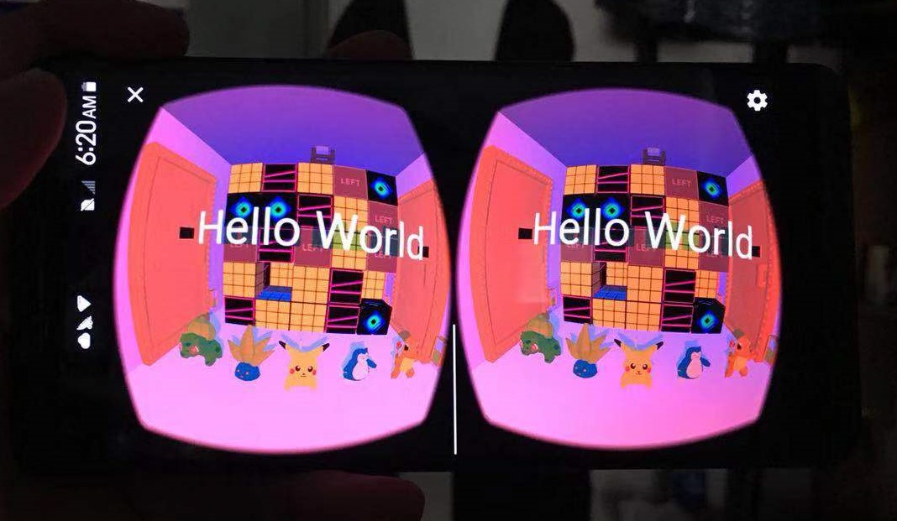

# 虚拟现实技术作业一：走迷宫

计63 黄冰鉴 2016011296

2019/10/21

---

### 概述

我在这次作业中使用Google CardBoard VR实现了一个3D场景的走迷宫游戏，玩家可以使用磁钮在迷宫中沿视线方向行走。游戏中实现了碰撞检测以及光影效果，使得场景渲染更加逼真，且玩家更加有方向感。值得一提的是，我实现了一个3维的立体迷宫，玩家需要上下前后左右的移动才能走出迷宫。另外我在场景中布置了一些摆设，使场景更加真实。

#### 创新点

- 碰撞引擎实现以及穿模问题的解决
- 3维的立体迷宫
- 逼真光影效果




### 程序详细介绍

我在这次作业中使用了公开的Android ViroCor SceneKit。它很好地支持了3D场景绘制，光影效果叠加，视角变换等功能。以下是我使用的库。

```java
import com.viro.core.AmbientLight;
import com.viro.core.AsyncObject3DListener;
import com.viro.core.Box;
import com.viro.core.Camera;
import com.viro.core.ClickListener;
import com.viro.core.ClickState;
import com.viro.core.Geometry;
import com.viro.core.Material;
import com.viro.core.Node;
import com.viro.core.Object3D;
import com.viro.core.OmniLight;
import com.viro.core.Scene;
import com.viro.core.Sphere;
import com.viro.core.Spotlight;
import com.viro.core.Text;
import com.viro.core.Texture;
import com.viro.core.TouchState;
import com.viro.core.TouchpadTouchListener;
import com.viro.core.Vector;
import com.viro.core.ViroView;
import com.viro.core.ViroViewGVR;
import com.viro.core.ViroViewOVR;
import com.viro.renderer.BuildConfig;
```

以下是我调用的接口

``` java
Scene.getRootNode();      
AmbientLight.setColor();
AmbientLight.setIntensity();
Spotlight.setPosition();
Spotlight.setDirection();
Spotlight.setAttenuationStartDistance();
Spotlight.setAttenuationEndDistance();
Spotlight.setInnerAngle();
Spotlight.setOuterAngle();
Spotlight.setColor();
Spotlight.setIntensity();
Spotlight.setCastsShadow();
Spotlight.setShadowMapSize();
Spotlight.setShadowNearZ();
Spotlight.setShadowFarZ();
OmniLight.setPosition();
OmniLight.setAttenuationStartDistance();
OmniLight.setAttenuationEndDistance();
OmniLight.setColor();
OmniLight.setIntensity();
lightNode.addLight();
Node.addChildNode();
Object3D.loadModel();
Node.setScale();
Node.setRotation();
Node.setPosition();
View.setPointOfView();
View.setScene();
```


### 实现流程

一开始，我使用Google VR SDK，搭建了环境，然后通过阅读样例代码的方式了解了手机VR渲染的步骤。

接着我仿照样例的样子，向场景中加入了迷宫需要的正方体。然后我实现了PuzzleGenerator用于读取配置，生成迷宫，绘制应该出现的方块以及隐藏路径上的方块。我用headView提供的forwardDirection作为视线方向，通过矩阵乘法实现了视点移动的效果。在这个过程中，我阅读了许多OpenGL的文档和介绍，明白了渲染的步骤顺序，然后在适当的位置插入Translate矩阵，这样就能将物体和视点做变换。

随后，为了实现一个真实的迷宫，我增加了碰撞检测。因为我的方块坐标都是整数，所以相对好写。但是写完之后我发现，因为ProjectiveView的问题，即使玩家停在了方块外面，仍然能从一定程度上看到方块内的颜色，俗称“穿模”。在和王安东同学讨论过之后，我增大了碰撞体的虚拟外部边框，从而避免了这一问题。至此迷宫基本功能实现完成。效果如图：


然而，在我希望进一步美化场景和引入多种多样的模型时，我发现Google SDK对obj格式3维物体文件的支持不足。虽然SDK能够读取obj文件，但是却没有提供读取mtl纹理样式的方法，所以大部分网上能找到的模型都无法使用。为此我希望寻找到可以读取mtl文件的库。

在这个过程中，我发现了Android ViroCore SceneKit。这是一个github上的开源项目，有非常详细的使用文档，他对OpenGL进行了封装，能够支持高抽象层次的AR/VR场景绘制。我花了约半天的时间上手，验证了它能够很方便地绘制场景，以及读取带有纹理样式的3D物体obj文件。于是我将原来的工作移植过来，并且增加了光照和阴影等效果，让场景更逼真。至此迷宫完成。效果如图：


### 过程中的难点

我必须要说，这个“小作业”的难度非常大。

在此之前，我已经上过图形学课程，并且在Android Studio积累了非常多的开发经验。但是这个实验上手依然非常困难。首先Google VR SDK本身就有版本问题，最新的1.20版本有非常多的bug，要求开发者阅读github上的issue，修改gradle中使用的SDK版本，才能正常运行Sample。然后在阅读代码的过程中，因为涉及到非常底层的OpenGL操作，如果不了解OpenGL的原理的话，很难看懂Sample的运行机制。于是还需要开发者先花大量时间阅读OpenGL相关文档，了解Translate/Scale/Rotation三类矩阵的工作原理，以及OpenGL的View--Camera--Projection的渲染步骤。

在完成了这两部分准备工作之后，开发者才能正式地开始写代码绘制自己想象中的场景。在绘制过程中我并没有遇到太多困难，但是在后期加入纹理和光照时，Google VR SDK仍然要求使用OpenGL的方法绘制，这又要求开发者了解纹理和光照的工作原理。据我所知，王安东同学在纹理和阴影的实现上至少花费了一周的时间。

因此，我认为此次作业难度很大，希望助教在之后的作业中考虑作业难度。


### 参考文献

Google VR SDK: <http://developers.google.com/vr/android/>

CardBoardVR Sample: <https://github.com/JimSeker/CardBoardVR>

OpenGL Tutorial: <http://www.opengl-tutorial.org/beginners-tutorials/tutorial-3-matrices/>

ViroCore: <https://github.com/viromedia/virocore>

ViroCore Tutorial: <https://virocore.viromedia.com/docs/getting-started>